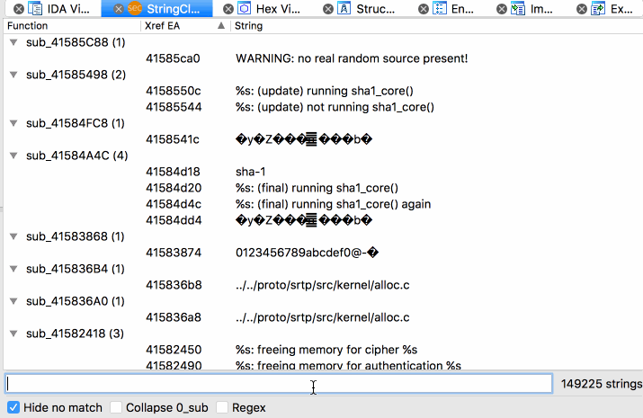

# IDA StringCluster - extending IDA's string navigation capabilities

When reverse engineering software, strings within a binary are often a very insightful resource on the inner workings of the target. However, navigating strings by default in IDA can be more effective when it comes to quickly identifying interesting functions.

This plugin extends IDA Pro's capabilities to display strings within the binary by clustering found strings on a per-function basis. Strings that don't belong to a function are grouped into the 0_sub pseudo-function. This allows to quickly identify interesting functionality as well as strings that are not part of a function, quickly navigate through the results, filter them, and hopefully making manual analysis more effective.

In short the plugin does the following:
* group strings that belong to a function into a visual representation indicating this
* navigate quickly to string, its reference, and the function using it
* filter strings using regular expressions
* filter results while being able to see non-matches within the same function
* sort strings by EAs on a per-function basis

Simply copy the python file to the IDA plugin directory.

NOTE: name changes in functions do not instantly reflect in strcluster. A reload currently requires launching the plugin again.
